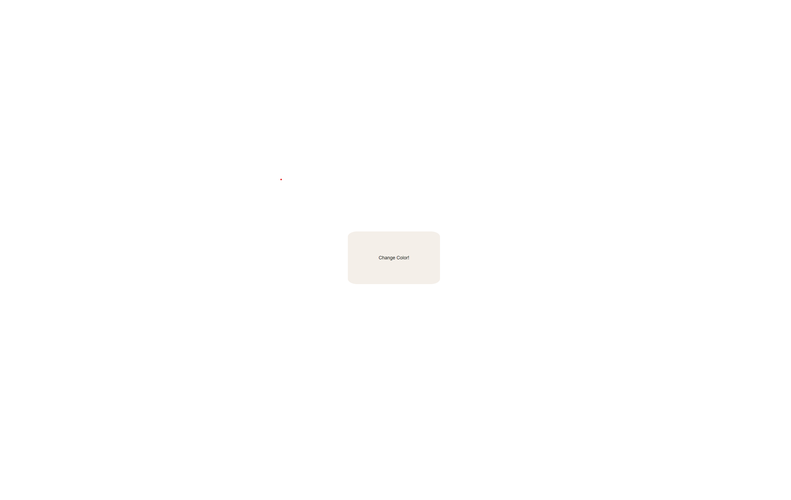
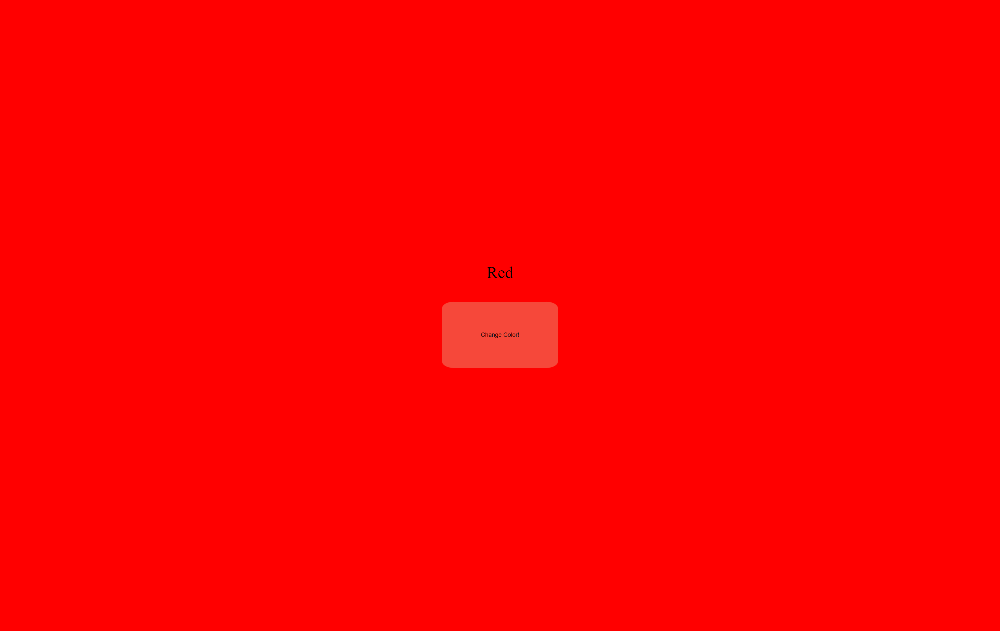

# color-flipper

This repository contains the HTML, CSS and Javascript source code for the color flipper project.

## Usage

Usage is as simple as can be. Simply click the "Change Color!" button located at the center of the page, and watch the page change color! Colors are chosen randomly from a pre-defined array. 

